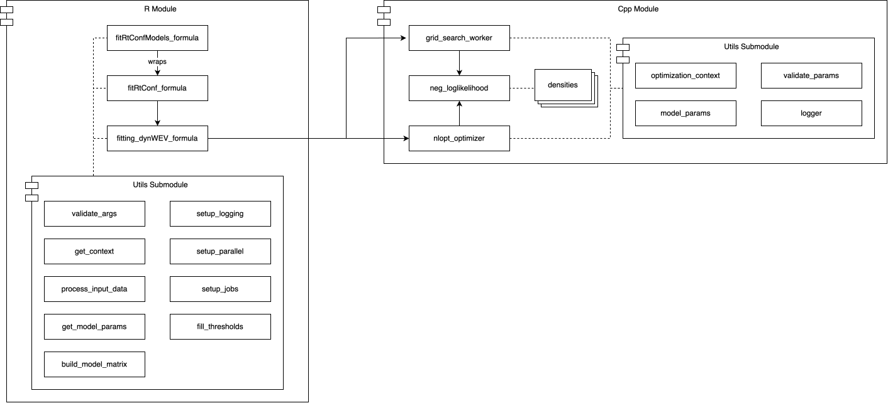

# dynConfiRIDP: R package for sequential sampling models of decision confidence

This package provides functions for fitting, predicting, and simulating data based on *Sequential Sampling Models of Decision-Making and Confidence Judgments*. It uses a **formula-based** interface to allow for easy specification of experimental manipulations (e.g., `a ~ SAT`).

This repository branch (`integration`) is a significant architectural rework of the original **dynConfiR** package, completed as part of an Interdisciplinary Project (IDP). It features a refactored Cpp backend and a more modular R-side architecture.

The package includes density functions for decision, confidence, and response time outcomes for several models, including:
- Dynamic Visibility, Time, and Evidence model (**dynaViTE**)
- Dynamic Weighted Evidence and Visibility (**dynWEV**)
- Two-Stage Signal Detection (**2DSD**)
- Independent and Partially-Correlated Race Models (**IRM/PCRM**)

(see [Hellmann et
al. 2023](https://doi.org/10.1037/rev0000411) for details, preprint
available [here](https://osf.io/9jfqr))

## Table of Contents
- [Installation](#installation)
- [Package Structure](#package-structure)
- [Collaboration](#collaboration)
- [Open Issues](#open-issues)
- [References](#references)
- [Contact](#contact)

## Installation

This `integration` branch contains the development version of the package. You can install it using `devtools`:

```R
devtools::install_github("SeHellmann/dynConfiRIDP", ref = "integration")
```

For the latest stable version (from the main branch), you can install from **CRAN**:

```R
install.packages("dynConfiR")
```
## Package Structure

This branch features a new architecture designed to be more modular, efficient, and maintainable. It separates the R-side user interface from the Cpp backend and isolates helper functions into distinct utility submodules.



### R Module (the Orchestrator)

This module contains all R code and manages the user interface, data preparation, and optimization control.

- **Exported Functions**: `fit_rtconf_models_formula` is the main parallel wrapper for fitting multiple subjects or models. It calls `fit_rtconf_formula` for each individual fit.
- **Internal Fitting Logic**: `fitting_dynwev_formula` is the internal "main" function for a single fit. It orchestrates the process:
  1. Sets up a parameter grid for the **grid search**.
  2. Calls the Cpp `grid_search_worker` in parallel to find the best starting points.
  3. Calls the Cpp `nlopt_optimizer` in parallel for the `n_attempts` best starting points.
  4. Formats the final result.
- **R Utils Submodule**: A set of helper scripts responsible for all R-side logic:
  - `utils_validate_args.R`: Provides user-friendly error messages by validating all function arguments before execution.
  - `utils_get_context.R`: Creates the `context` objects (one for R, one for Cpp) that pass state through the application.
  - `utils_process_input_data.R`: Cleans, validates, and transforms the input `data.frame` into the `dependent_vars` matrix.
  - `utils_get_model_params.R`: Sorts parameters into fixed, estimated, and manipulated categories and sets model-specific defaults.
  - `utils_build_model_matrix.R`: Uses `stats::model.matrix` to build the predictor matrix and creates the index mappings for Cpp.
  `utils_setup_jobs.R` & `utils_setup_parallel.R`: Configure the future parallel backend (flat or nested) and prepare the list of all model-subject jobs.
  - `utils_fill_thresholds.R`: A post-processing helper to fill in un-fittable confidence thresholds if a subject did not use all ratings.

### Cpp Module (the Backend)
This module, written in Cpp with Rcpp, handles all high-performance computation. It is designed to be a "state-aware" backend that receives all necessary data from R in a single DTO.
- **Entry Points**: `grid_search_worker` and `nlopt_optimizer` are the two Rcpp exported functions called directly by R. They receive the DTO and manage the Cpp-side optimization process.
- **Optimization Logic**: `neg_loglikelihood` is the core objective function. It iterates over all trials, calling `get_trial_params` to get the parameters for that specific trial and summing the log-likelihood from the `densities`.
- **Cpp Utils Submodule**:
  - `optimization_context.hpp/.cpp`: Defines the `OptimizationContext` class, the main Data Transfer Object (DTO) from R. It holds all constant data (model matrix, dependent variables, parameter mappings) for the entire fit.
  - `ModelParameters`: A Cpp struct defined in `optimization_context.hpp` that holds the parameters for a single trial after transformations.
  - `logger.hpp`: A utility that bridges Cpp logging calls back to the R `logger` package, allowing Cpp code to log to the same file as R with the same log layout.
  - `validate_params.h`: A Cpp-side helper for validating parameter sets before they are used by the density functions.
- **Densities**: The core `g_minus_WEVmu` density function (and others, e.g., `density_2DSD`) are called by `neg_loglikelihood`.
- **NLopt Integration**: The Cpp optimizer uses the `nloptr` R package to link to the C API headers for the NLopt library. This avoids needing to bundle the entire NLopt library with this package. (see a similar example [here](https://github.com/eddelbuettel/rcppnloptexample)).

## Collaboration

To improve the onboarding and development workflow for collaborators:
- **Continuous Integration**: The package includes a GitHub Action workflow (`.github/workflows/R-CMD-check.yaml`) that automatically runs `R CMD check` on Windows, macOS, and Ubuntu for every push and pull request to the main and integration branches. This process now incorporates the initial setup for a `testthat` suite, which runs a simple sanity check to verify that the package properly builds and links its Cpp backend. This enhances the **CI** by confirming the package is not only installable but also correctly compiled.
- **IDE Setup**: The `scripts/configure_clangd.R` script generates a `.clangd` file. This provides Cpp auto-completion, linting, and error-checking in IDEs, making Cpp development much easier.

## Open Issues

This rework focused on building a robust, formula-based architecture for the **dynaViTE**/**dynWEV**/**2DSD** model family. The following items are key next steps:
- **Extend to Race Models**: Integrate the existing Race Models (**IRM**/**PCRM**) density functions with the C++ `OptimizationContext` and update the R-side `fit_rtconf_formula_dispatcher` to support them.
- **Implement More Optimizers**: The `nlopt_optimizer.cpp` file only supports **Nelder-Mead** and **bobyqa**. This should be extended to support other optimization algorithms (e.g., **L-BFGS-B**).
- **Optimize Grid Search**: Refine the initial grid search strategy. The current implementation uses a simple random search (`rnorm`) to find starting points. This could be improved by for example incorporating domain-specific parameter priors to cover the parameter space more efficiently.
- **End-to-End Benchmarking**: Enhance the `fit_rtconf_models_formula` wrapper to systematically track and report the wall-clock time for each model-subject fit, providing a simple framework for performance profiling.
- **Improve Nested Parallelism**: Make the nested parallel plan (`n_cores = c(outer, inner)`) more robust, particularly in handling error propagation, logging, and potential orphaned processes from inner workers.
- **Refactor Density Interface**: The `ModelParameters` struct currently uses the Adapter Pattern (via the `to_density_vector` method) to communicate with the legacy density functions. This interface should be refactored so the density functions can accept the `ModelParameters` struct directly.
- **CI/CD Unit Tests**: A minimal `testthat` suite has been added to verify the core build and Cpp linking. This initial setup should be expanded by adding more tests to validate all the different functionalities of the package (*pre-processing, density functions, ...*).

## References

Hellmann S, Zehetleitner M, Rausch M. Simultaneous modeling of choice,
confidence, and response time in visual perception. Psychol Rev. 2023
Mar 13. doi: [10.1037/rev0000411](https://doi.org/10.1037/rev0000411).
Epub ahead of print. PMID: 36913292.

## Contact

For comments, remarks, and questions please contact me:
<sebastian.hellmann@ku.de> or [submit an
issue](https://github.com/SeHellmann/dynConfiR/issues).
